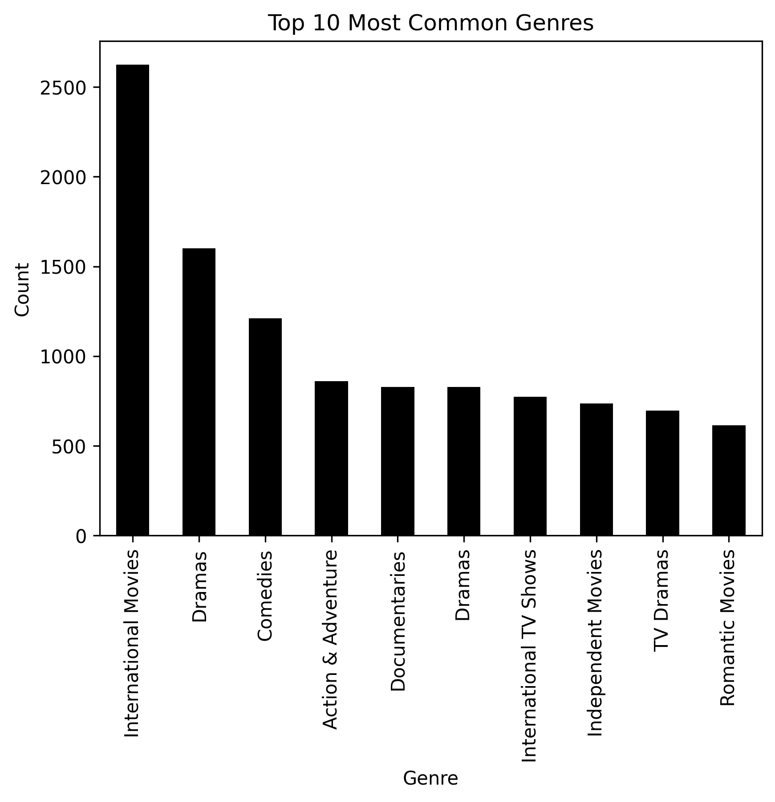
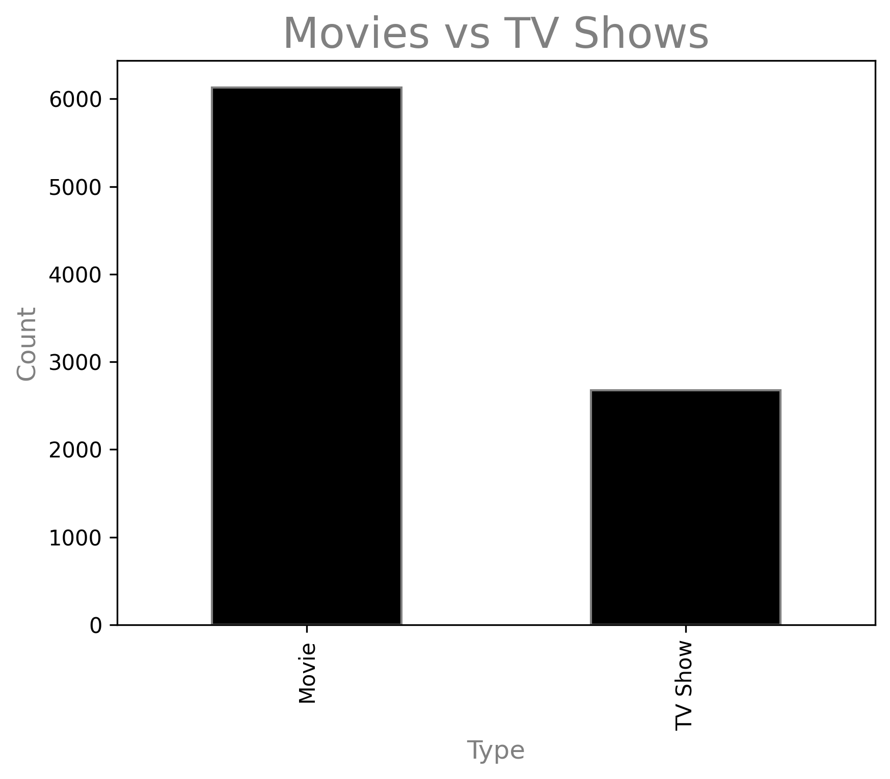
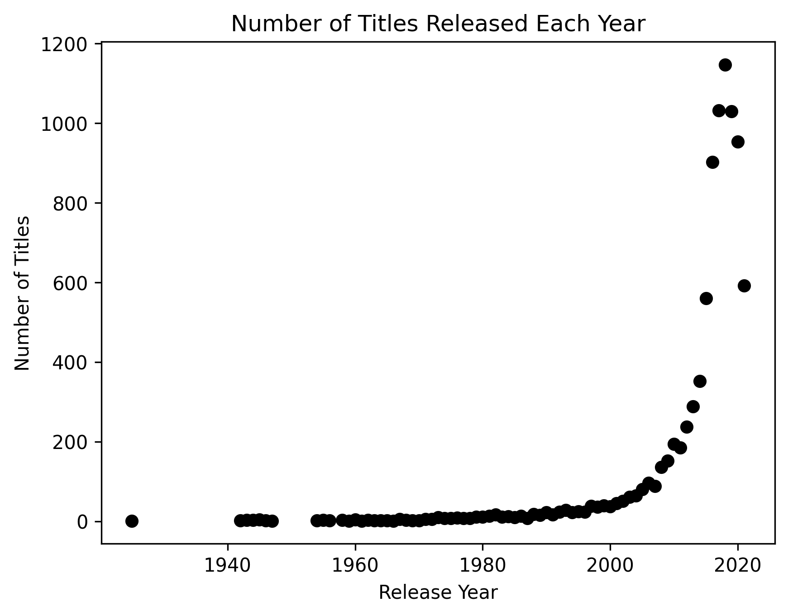

Netflix Dataset Analysis
Overview:

This project explores the Netflix dataset, which contains information about movies and TV shows, including titles, directors, cast, country, release year, rating, duration, genres, and descriptions.

The analysis aims to:

$ Understand trends in content type and release year.

$ Identify the most common genres.

$ Compare the number of movies vs TV shows.

$ Visualize trends over time.

Dataset Columns:

| Column Name    | Description                      |
| -------------- | -------------------------------- |
| `show_id`      | Unique identifier for each show  |
| `type`         | Whether it is a Movie or TV Show |
| `title`        | Title of the show                |
| `director`     | Director(s) of the show          |
| `cast`         | Main cast of the show            |
| `country`      | Country of production            |
| `date_added`   | Date when added to Netflix       |
| `release_year` | Year of release                  |
| `rating`       | Content rating                   |
| `duration`     | Duration in minutes or seasons   |
| `listed_in`    | Genres                           |
| `description`  | Short description of the show    |

Visualizations
1️⃣ Most Common Genres

Shows the most frequently listed genres on Netflix.

Key Insights:

Genres like Dramas and Comedies dominate the platform.

Helps identify popular categories and user interests.

2️⃣ Movies vs TV Shows

Compares the count of movies and TV shows.

Key Insights:

Netflix has more [Movies / TV Shows] (replace with actual count).

Indicates platform focus and content distribution trends.

3️⃣ Number of Titles Each Year

Shows how many titles were released each year.

Key Insights:

Peaks in content releases can indicate growth years.

Helps understand historical trends in Netflix production.
